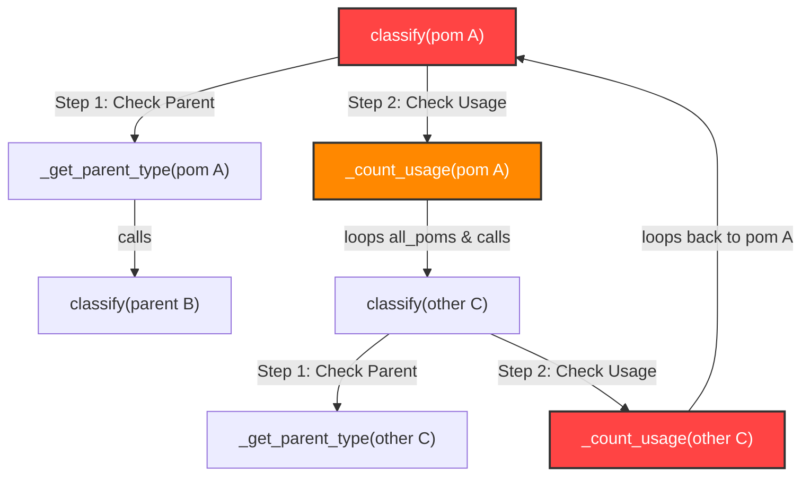

# Cautionary Engineering Advisory: Infinite Recursion Loop in Maven Project Classification

> [!WARNING]
> **CRITICAL ARCHITECTURAL HAZARD FOR DEVELOPERS & LLMs**
> When working with project classification, graph models, or POM dependency trees in `projectgraph`, never implement recursive classification checks (`_get_parent_type`, `_count_usage`) without explicit cycle detection (`_visiting`) and memoization (`_memo`). Doing so triggers fatal Python `RecursionError` crashes that take down the service or extraction pipeline.

---

## 1. Incident Overview

In `projectgraph` (`pom_parser.py` and `maven_extractor.py`), the `ProjectClassifier.classify()` class method was vulnerable to an infinite recursion loop:

```text
RecursionError: maximum recursion depth exceeded
  File "pom_parser.py", line 388, in _count_usage
    other_type, _ = cls.classify(other, all_poms)
  File "pom_parser.py", line 337, in classify
    usage_count = cls._count_usage(pom, all_poms)
  File "pom_parser.py", line 307, in classify
    parent_type = cls._get_parent_type(pom, all_poms)
```

Whenever Maven projects were scanned—whether during test execution or directory loading—the Python interpreter crashed before building the graph model or serving UI requests.

---

## 2. Root Cause Analysis

The classification logic categorizes Maven POMs into architectural roles:
* `Internal Parent BOM`
* `Service BOM`
* `Service Framework`
* `Service Project`
* `Service Code`
* `Common Component`
* `Aggregator POM`, etc.

To determine these roles, the classifier evaluated two contextual queries:
1. **Parent Inspection (`_get_parent_type`)**: Looks up the POM's parent in `all_poms` and calls `classify(parent)`.
2. **Usage Inspection (`_count_usage`)**: Iterates through `all_poms`, calls `classify(other)` on each, and checks if `other` is `Service Code` that depends on `pom`.

### The Three Deadlocks



1. **Self-Invocation inside Loop**:
   `_count_usage(pom, all_poms)` iterated through `for other in all_poms` without filtering out `other.path == pom.path`. Thus `classify(pom)` directly invoked `classify(pom)`.
2. **Mutual Dependency / Sibling Traversal**:
   When classifying `POM A`, `_count_usage` calls `classify(POM B)`. But classifying `POM B` evaluates `_count_usage` or `_get_parent_type`, which loops back and calls `classify(POM A)`.
3. **No Memoization**:
   Because results were never cached, even acyclic graphs caused an exponential branching factor of duplicate calls ($O(2^N)$), quickly exhausting Python's default stack limit of 1000 calls.

---

## 3. Vulnerable vs. Remediated Pattern

### ❌ Vulnerable Pattern (Do NOT repeat this)

```python
class ProjectClassifier:
    @classmethod
    def classify(cls, pom: PomInfo, all_poms: List[PomInfo]) -> Tuple[str, str]:
        # Unconditionally calls parent classification
        parent_type = cls._get_parent_type(pom, all_poms)
        
        # Unconditionally iterates through all other POMs and classifies them
        if packaging == "jar" and parent_type in ("Internal Parent BOM", "Service BOM"):
            usage_count = cls._count_usage(pom, all_poms)
            ...

    @classmethod
    def _count_usage(cls, pom: PomInfo, all_poms: List[PomInfo]) -> int:
        count = 0
        for other in all_poms:
            # BUG 1: other can be pom itself
            # BUG 2: calls classify with no visited set or cache!
            other_type, _ = cls.classify(other, all_poms)
            if other_type == "Service Code":
                ...
```

---

### ✅ Remediated Pattern (Standard for this repository)

Both `pom_parser.py` and `maven_extractor.py` must use memoization and an active recursion tracker:

```python
class ProjectClassifier:
    @classmethod
    def classify(
        cls,
        pom: PomInfo,
        all_poms: List[PomInfo],
        _memo: Optional[Dict[str, Tuple[str, str]]] = None,
        _visiting: Optional[Set[str]] = None,
    ) -> Tuple[str, str]:
        """Classify a POM into a project type. Returns (type, reason)."""
        if _memo is None:
            _memo = {}
        if _visiting is None:
            _visiting = set()

        # 1. Return cached result if already computed
        if pom.path in _memo:
            return _memo[pom.path]

        # 2. Cycle detection: if already in current call stack, terminate recursion
        if pom.path in _visiting:
            return ("Other Module", "cycle detected")

        _visiting.add(pom.path)

        try:
            # Pass _memo and _visiting down to helper methods
            parent_type = cls._get_parent_type(pom, all_poms, _memo, _visiting)

            # Classification logic...
            if packaging == "jar" and parent_type in ("Internal Parent BOM", "Service BOM"):
                usage_count = cls._count_usage(pom, all_poms, _memo, _visiting)
                ...
            
            result = (classified_type, reason)
        finally:
            _visiting.remove(pom.path)

        _memo[pom.path] = result
        return result

    @classmethod
    def _get_parent_type(
        cls,
        pom: PomInfo,
        all_poms: List[PomInfo],
        _memo: Optional[Dict[str, Tuple[str, str]]] = None,
        _visiting: Optional[Set[str]] = None,
    ) -> Optional[str]:
        if not pom.parent:
            return None
        for other in all_poms:
            if other.ga == pom.parent.ga and other.version == pom.parent.version:
                parent_type, _ = cls.classify(other, all_poms, _memo, _visiting)
                return parent_type
        return None

    @classmethod
    def _count_usage(
        cls,
        pom: PomInfo,
        all_poms: List[PomInfo],
        _memo: Optional[Dict[str, Tuple[str, str]]] = None,
        _visiting: Optional[Set[str]] = None,
    ) -> int:
        count = 0
        for other in all_poms:
            # Skip self to prevent trivial self-recursion
            if other.path == pom.path:
                continue
            other_type, _ = cls.classify(other, all_poms, _memo, _visiting)
            if other_type == "Service Code":
                for dep in other.dependencies:
                    if dep.ga == pom.ga:
                        count += 1
                        break
        return count
```

---

## 4. Instructions for Future LLM Coding Assistants

When prompted to modify or extend `pom_parser.py`, `maven_extractor.py`, `maven_runner.py`, or any dependency classifier:

1. **Do not reintroduce raw classification loops**:
   Never remove the `_memo` or `_visiting` parameters from `classify()`, `_get_parent_type()`, or `_count_usage()`.
2. **Always skip self-evaluation**:
   Any function that counts references or dependencies across `all_poms` must include `if other.path == pom.path: continue`.
3. **Prefer 2-Phase Analysis for New Metrics**:
   If a new classification rule requires querying the classification of *other* projects, compute it in a two-pass pipeline:
   - **Pass 1 (Intrinsic Properties)**: Packaging type, local plugins, direct dependencies, POM hierarchy.
   - **Pass 2 (Contextual Properties)**: External usage counts, downstream dependents, cross-project BOM imports.
4. **Run the Full Test Suite**:
   Always verify changes using:
   ```bash
   npx playwright test test_projects/__e2e__/ui_tests.spec.js
   ```
   And run a quick Python test on multi-project classification:
   ```bash
   python -c "from maven_runner import build_model; build_model('test_projects', 'cache')"
   ```
